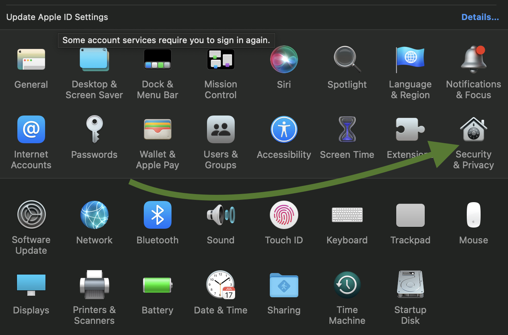

## How to download & install on macOS  

Please note that I do not possess a digital certificate for macOS. This means that macOS will issue various warnings when downloading and executing these programs. This certificate has to be bought for each operating system, I'll look into it, but for now this can not be helped.

Open the [Github release section](https://github.com/Grrwahrr/avtomat_dos/releases) and download the macOS build by clicking the relevant file.  
If you have an Apple Silicone (M1) based device, pick avtomat-dos.macOS.m1.arm64.dmg  
If you have an Intel based Apple, pick the avtomat-dos.macOS.intel.x64.dmg  

Open the downloaded file & drag the app into your Applications folder.  

Start the application.

It will say that the certificate is not known to Apple. Click _OK_.  

Open the _System Preferences_ application. Click _Security & Privacy_.  

In the _General_ tab, click the _Open Anyway_ button. Click the _Open_ button in the prompt.  
