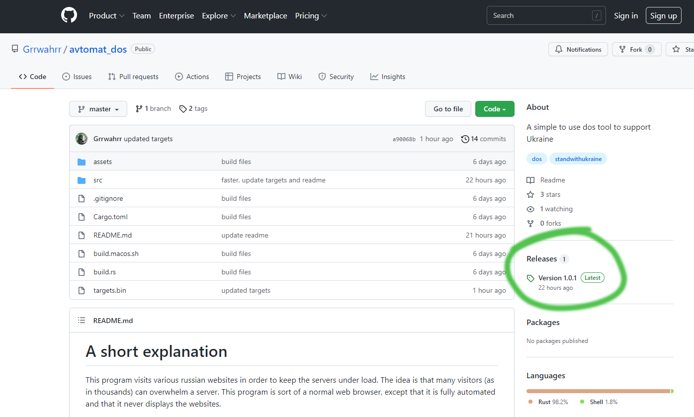
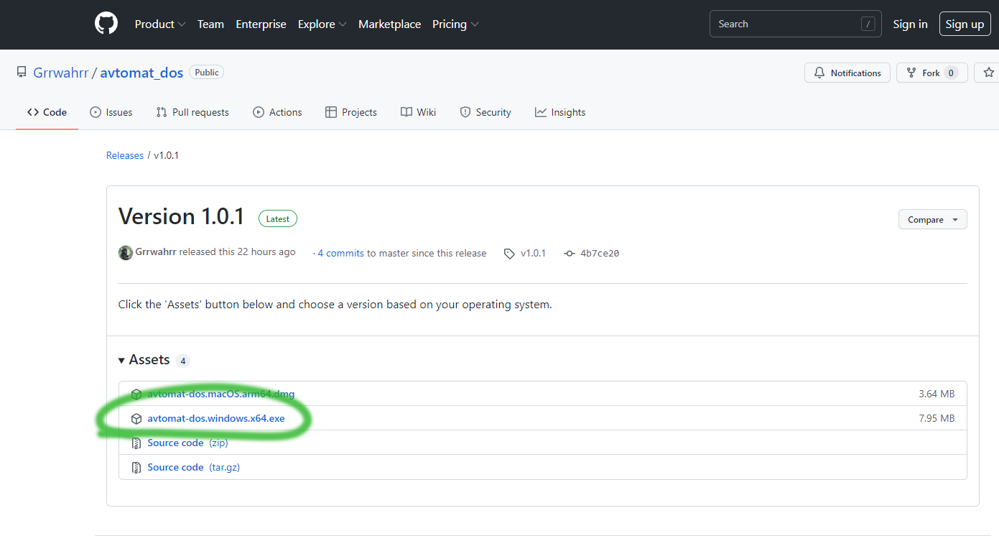
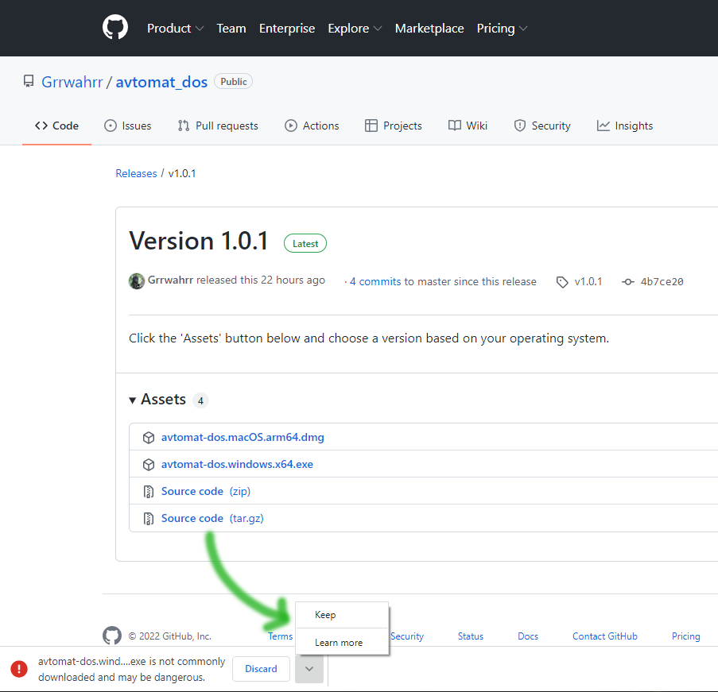
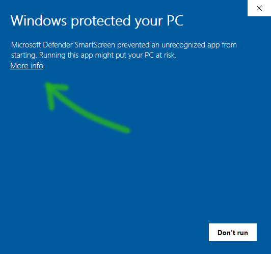
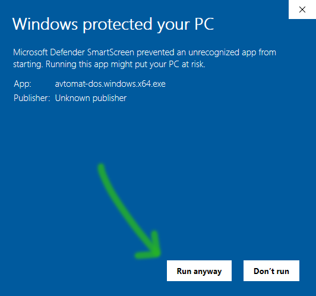
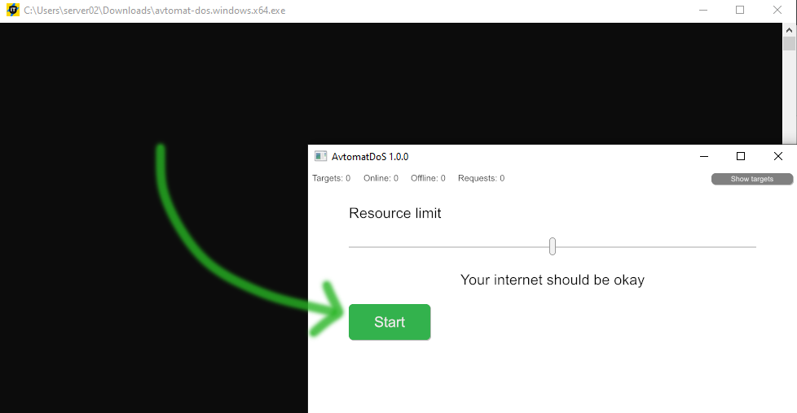
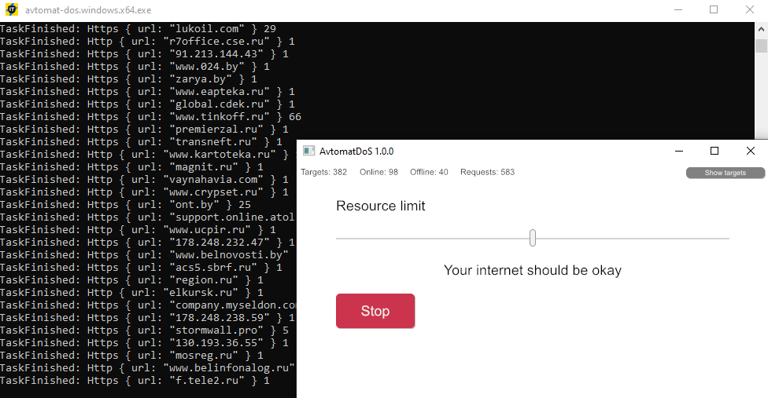

## How to download & install on Windows  

Please note that I do not possess a digital certificate for Windows. This means that Windows will issue various warnings when downloading and executing this program. This certificate has to be bought for each operating system, I'll look into it, but for now this can not be helped.

Open the [Github release section](https://github.com/Grrwahrr/avtomat_dos/releases).  

Choose the Windows version & click it to download.  

Allow the file to be stored on your computer. Then open it.  

Click the _More info_ button.  

Click _Run anyway_.  

Click the _Start_ button.  

That's it.  
